# Как построить надёжный ров?

## Оглавление

## Выбор провайдера

Для хостинга впн сервера с небольшим количеством человек достаточно VPS на 1GB RAM и 1 CPU.
Лучше выбирать малоизвестного провайдера, т.к. вероятность того, что их ip находятся в российских geoip листах ниже.

> Есть вероятность того, что сервер находится зарубежом, но его ip закреплен за Россией, из-за чего на часть сайтов доступа не будет.

| Провайдер                      | Плюсы                                                                                                                                                                                                                             | Минусы                                                                                                                                                 |
| ------------------------------ | --------------------------------------------------------------------------------------------------------------------------------------------------------------------------------------------------------------------------------- | ------------------------------------------------------------------------------------------------------------------------------------------------------ |
| [HOSTKEY](https://hostkey.ru/) | - Малоизвестный провайдер → через него можно зайти на все сайты, даже на google ai studio, который **очень** придирчив к IP (проверено на сервера из Швецарии)<br>-Адекватные цены: около 300 руб/мес за минимальную конфигурацию | - Кривая консоль<br>- Виртуалка может выделяться сутки) (благо поддержка работает)                                                                     |
| [RuVDS](https://ruvds.com/)    | - Низкие цены: около 200 руб/мес за минимальную конфигурацию<br>- По отзывам друзей, IP +/- чистые (проверено на Нидерландах)                                                                                                     | - Известный провайдер, поэтому может не повезти с IP                                                                                                   |
| ZTV                            | - Топ по соотношению цена/ресурсы виртуалки                                                                                                                                                                                       | - IP зарубежных серверов закреплены за Россией, поэтому на google ai studio не пускает, однако с базовыми сайтами всё ок: Insta, ChatGPT, YouTube etc. |
## Настройка
### Начинаем с хоста
1. Подключение, обновление и создание выделенного юзера
```sh
# ssh root@SERVER_IP

apt update && apt upgrade -y

adduser vpn

usermod -aG sudo vpn

```
2. Проброс ssh ключей
```sh
ssh-keygen -t ed25519 -C "your_email@example.com"

ssh-copy-id -i ~/.ssh/id_ed25519.pub vpn@SERVER_IP
```
3. Подключаемся и настраиваем конфиг sshd
```sh
# sudo vim /etc/ssh/sshd_config.d/100-user.conf

Port 41238

PermitRootLogin no
LoginGraceTime 30
MaxAuthTries 3
MaxSessions 2

PubkeyAuthentication yes

PasswordAuthentication no
PermitEmptyPasswords no

KbdInteractiveAuthentication no
UsePAM no

AllowAgentForwarding no
AllowTcpForwarding no
GatewayPorts no
X11Forwarding no

PrintMotd no
ClientAliveInterval 300
ClientAliveCountMax 2

PermitTunnel no
```
4. Перезапускаем службу
```sh
# На Ubuntu/Debian:
sudo systemctl restart ssh

# На некоторых системах:
sudo systemctl restart sshd

# Eсли всё ещё можно подключиться по дефолтному порту, значит используется systemd socket activation — меняем порт в systemd socket unit
```
### Установка 3x-ui
```sh
# Проверяем, что установлен cron
sudo apt install cron

# Качаем консоль.
В ходе установки сразу же устаналиваем SSL сертификат на IP (везде нажимаем ДА)

curl -Ls https://raw.githubusercontent.com/mhsanaei/3x-ui/master/install.sh | sudo bash

# После установки в логах будет выведена ссылка для подключения, логин и пароль.

sudo x-ui

# Настраиваем пункты:
# - 19 (Установка SSL сертификата на IP хоста)
# - 22 (Firewall, открываем только 443, 80 и порт ssh)
# - 24 (Включить BBR)
# - 25 (Обновить Geo DB)
```
### Настройка 3x-ui
Заходим на консоль по скопированной ранее ссылке из лога. Если потеряли, можно снова запустить `x-ui` и выбрать пункт 10.
Поехали:
---
1. Создаём новое подключение
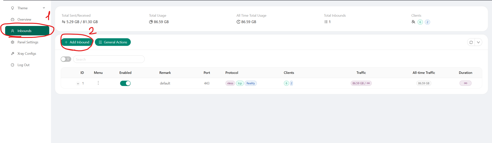
2. Обязательно выбираем порт 443, т.к. мы прячемся под https трафик
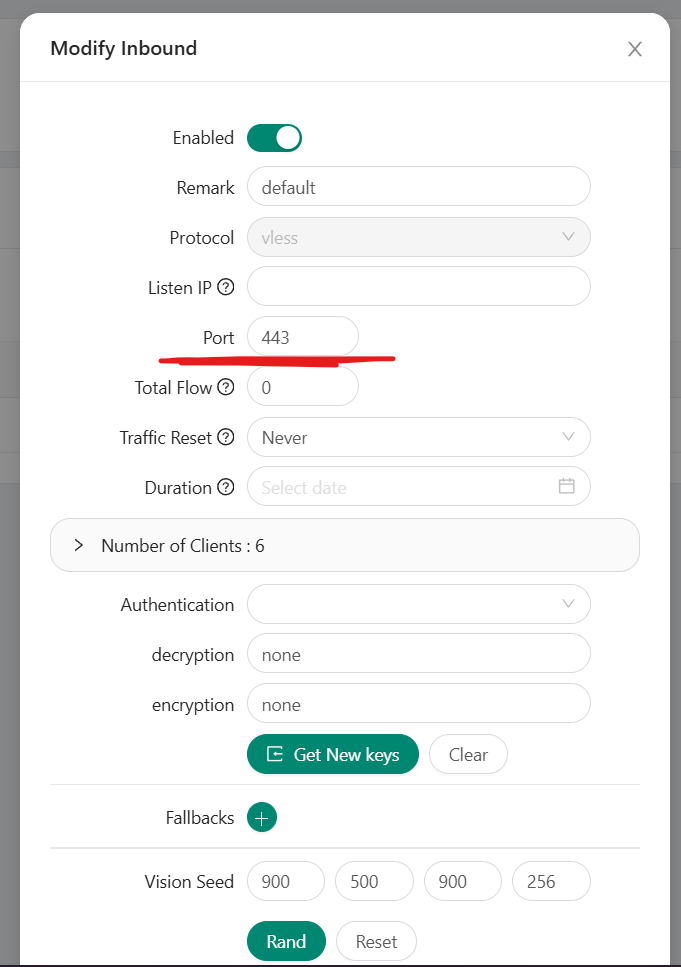
3. Выставляем протокол `Reality` + выбираем какой-нибудь сайт, т.к. под трафик с ним мы и прячемся
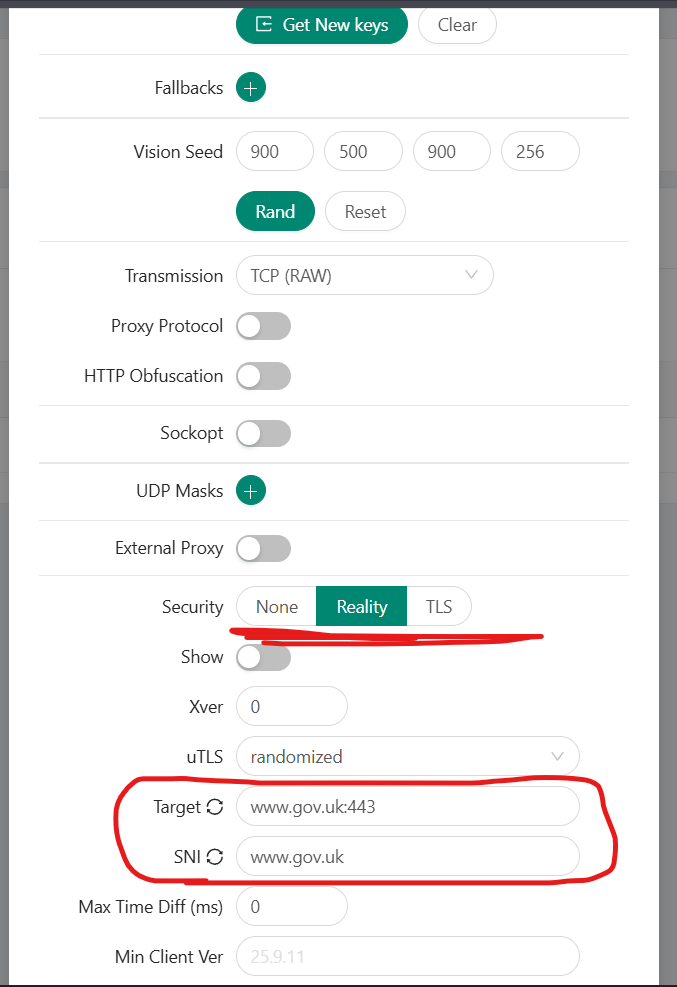
4. Генерим сертификат + включаем sniffing
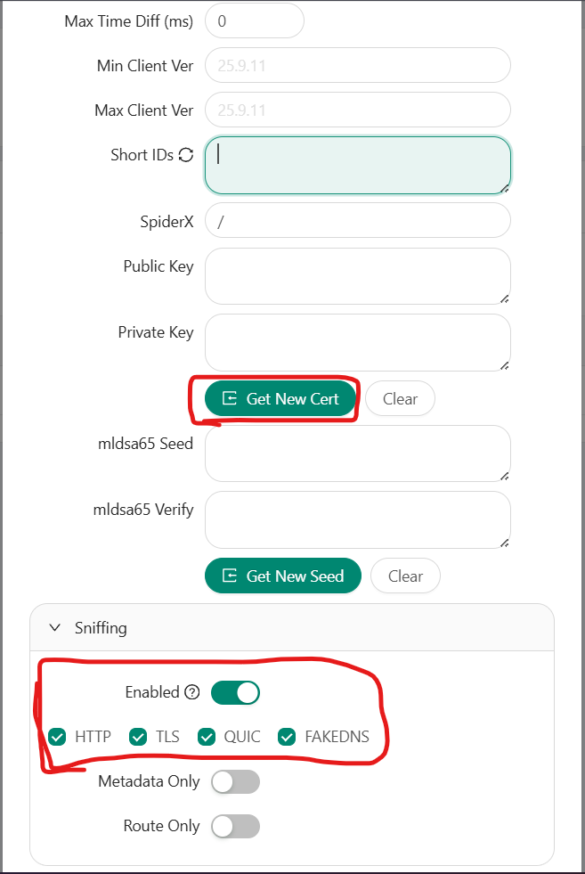
---
5. Убеждаемся, что у нас настроен сервис подписки
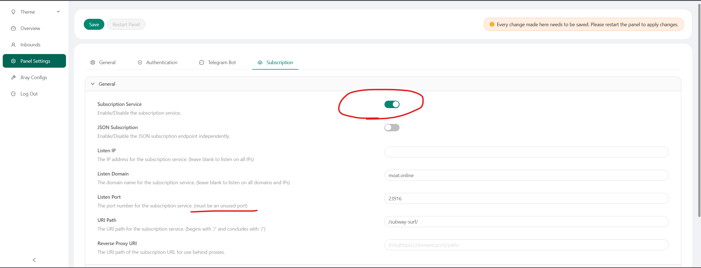

> **Справка:**
> Это веб-сервер, который возвращает актуальный ключ подключения к впн серверу.
> *Зачем это надо?* → Он позволяет администратору впн менять конфиг и не скидывать каждый раз клиентам ключ для подключения. Мобильные клиенты сами раз в сутки актуализируют состояние подключения (+ всегда можно через force обновить).

6. Создаём нового пользователя у нашего `inbound`
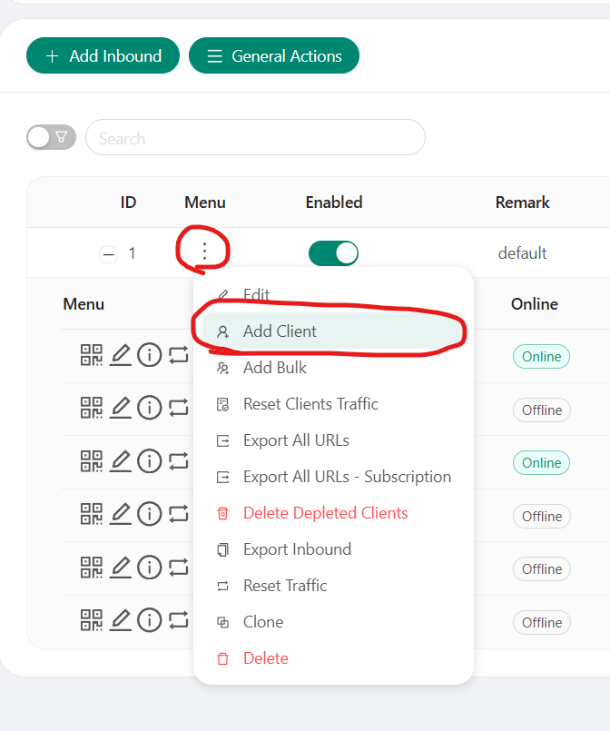

7. Обязательно генерим id подписки и обязательно выставляем flow `xtls-rprx-vision` (влюкчение протокола шифрования под https трафик)
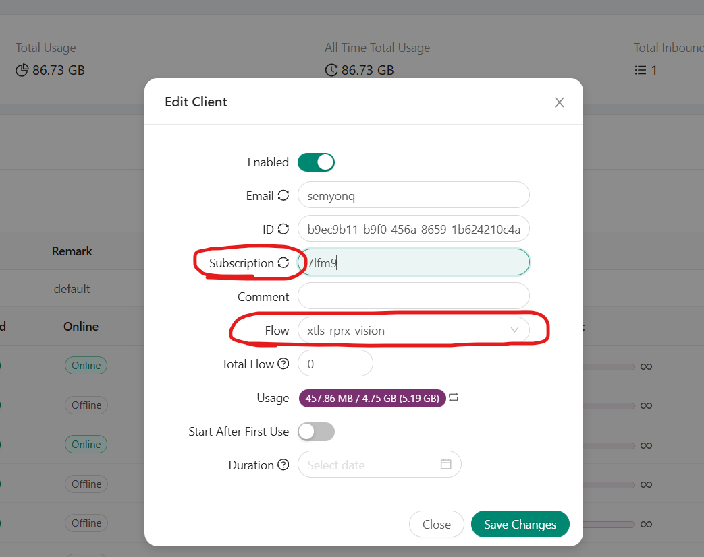

8. Можем также быстро настроить WARP подключение:
*Добавляем:*
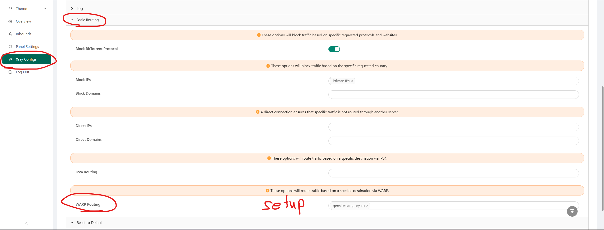
*Проверяем:*
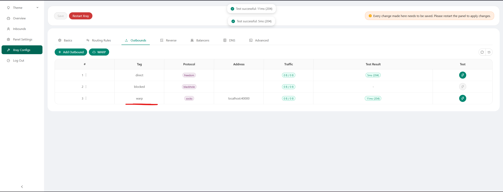

> **Справка:**
> Это технология CloudFlare, которая позволяет подключаться к CDN серверам.
> *Зачем это надо?* → Поможет добавить ещё один слой проксирования и скрыть реальный IP впн хоста
> К слову, встроенная настройка WARP у меня иногда хромает, поэтому её я вынес на сторону хоста. Делается тоже просто — [инструкция](https://wiki.aeza.net/ru/guides/warp/).

9. Настраиваем таблицу маршрутизации трафика
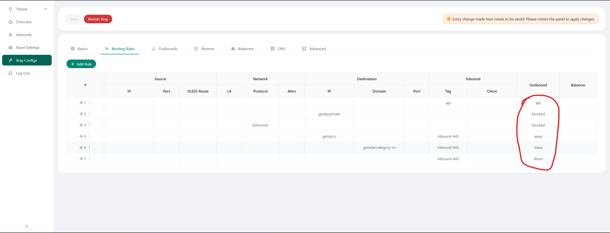

10. Делимся ссылкой для подключения к ВПН


> Справка:
> Для IPhone рекомендую приложение Happ
> Для Android / Windows / Linux v2rayNG с [github](https://github.com/2dust/v2rayNG)
> На телефоне можно либо настроить маршрутизирование траифка по правилам, либо выбрать приложения, для которых будет использоваться впн, а для которых — нет. Например, chrome всегда с VPN, Yandex Browser — всегда без.
> На ПК весь трафик пускать на прокси сервер, а уже в браузере его выборочно маршрутизировать через расширение [SwitchyOmega](https://chromewebstore.google.com/detail/proxy-switchyomega-v3/hihblcmlaaademjlakdpicchbjnnnkbo?utm_source=item-share-cb)
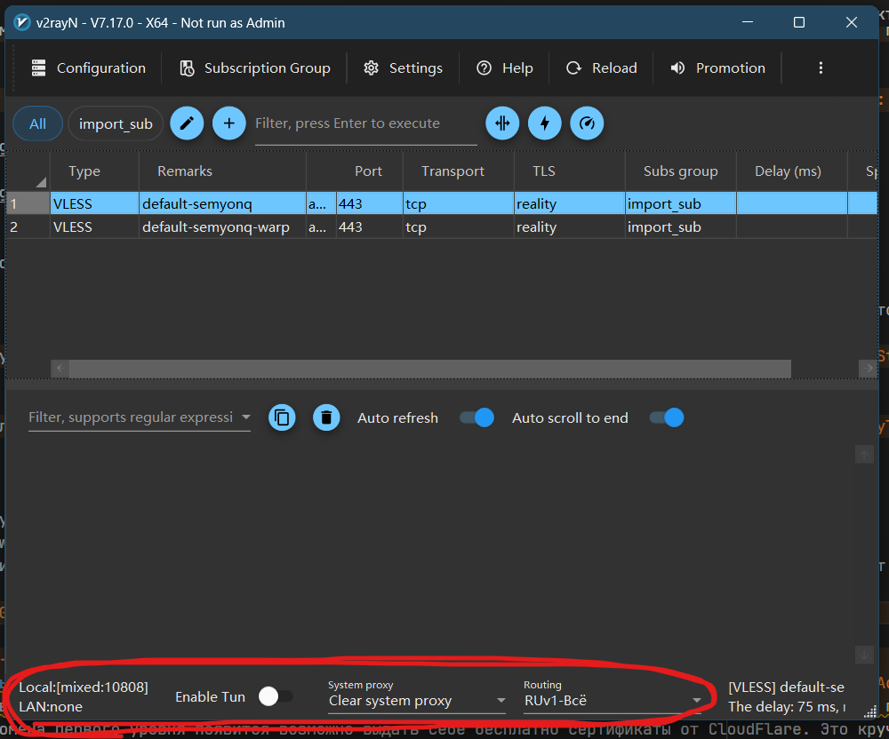 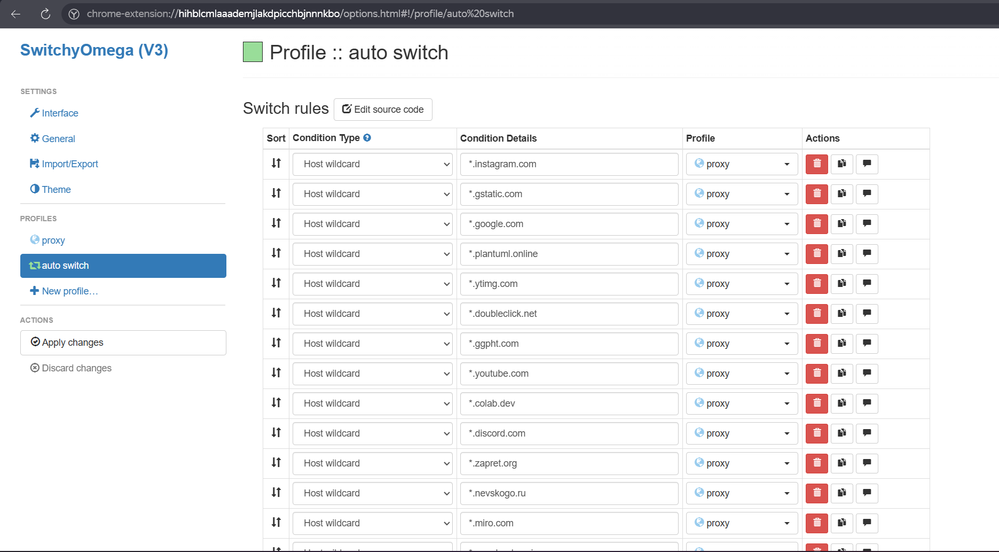

### Что можно улучшить
1. Добавить домен первого уровня своему серверу, чтобы больше походить на натуральный https трафик. Если не хочется покупать, можно найти бесплатный домен второго уровня
2. После добавления домена первого уровня появится возможно выдать себе бесплатно сертификаты от CloudFlare. Это круче, чем использовать самоподписанные.
3. Вынести сервис подписки на отдельных хост. Получится схема: `User -> Subscription Sevrer <-> VPN Servers`. Она позволит одной строкой для подключения (подпиской) выдавать несколько ВПН из разных локаций
4. Добавить промежуточный хост для обхода белых списков и удобной машрутизации (запросы на российские сервисы остаются в России, всё остальное — зарубеж). Получится схема: `User -> Russian VPN Sevrer <-> Foreign VPN Servers`.
5. Поиграться с протоколами и схемами проксирования. Вместо собственного промежуточного хоста можно попробовать использовать CDN сервера CloudFlare через WARP. И т.п.

Удачи!
